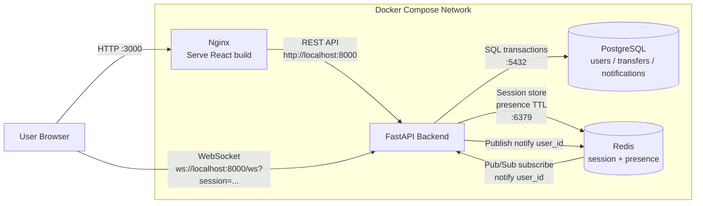

Kamloic Trust Bank Application – Overview
1. Introduction

This project is a Banking Application designed to demonstrate a modern web architecture using a stateless backend, session management with Redis, relational data storage with PostgreSQL, and real-time notifications via WebSocket.
The application focuses on core banking features rather than UI complexity, making it suitable for:
- technical interviews
- system design discussions
- DevOps / backend / platform engineering training

2. Key Features

- User registration and login
- Session-based authentication (stored in Redis)
- Account balance management
- Money transfer between users
- Real-time transfer notifications using WebSocket
- Designed to run in Docker and easily migrate to Kubernetes

3. High-Level Architecture:



4. Component Breakdown
4.1 Frontend (React)

- Provides UI for login, balance viewing, transfers, and notifications
- Communicates with backend via REST APIs
- Maintains session ID (issued by backend) in browser storage
- Opens a persistent WebSocket connection for real-time notifications

4.2 Backend API (FastAPI)
Implements REST endpoints:

- /login, /register
- /me, /balance
- /transfer
Stateless by design
All authentication state is stored in Redis
Handles WebSocket connections for push notifications

4.3 Redis (Session & Realtime Support)

Redis is used for:

- Storing user sessions (session ID → user mapping)
- Tracking online users
- Supporting real-time notification delivery
- Enabling horizontal scalability (future-ready for Redis Pub/Sub)
- This allows backend pods to remain stateless, which is ideal for scaling in Kubernetes.

4.4 PostgreSQL (Persistent Storage)

PostgreSQL is the system of record for:

- User accounts
- Account balances
- Transfer transactions
- Notification history
All critical financial data is persisted in PostgreSQL to ensure consistency and durability.

5. How to run

- Clone source code
- Run by docker compose:
```
cd banking-demo
docker compose up -d --build
docker compose ps -a
```

6. Check Redis and PostgreSQL

**Docker Compose**

- Redis (container `banking-redis`):
```bash
# Ping
docker exec banking-redis redis-cli ping

# List keys (session, presence, ...)
docker exec banking-redis redis-cli keys '*'

# Server information
docker exec banking-redis redis-cli info server
```

**Meaning of `keys '*'` results:**
- **`session:<id>`** — Login session: each key corresponds to a session (token) that the backend issues when user logs in. Value stores `user_id`, has TTL (e.g., 24h). The more users logged in, the more keys like this.
- **`presence:<user_id>`** — Online status: that user has an open WebSocket (frontend is still connected). Has short TTL (60s), renewed continuously while online. Key disappears when user exits or disconnects.

*(The `keys '*'` command lists all keys in DB 0; in production, use `SCAN` instead of `keys` if there are many keys.)*

- PostgreSQL (container `banking-postgres`, user `banking`, DB `banking`):
```bash
# Connect and list tables
docker exec -it banking-postgres psql -U banking -d banking -c "\dt"

# Check connection
docker exec banking-postgres psql -U banking -d banking -c "SELECT 1;"

# View users (if users table exists)
docker exec banking-postgres psql -U banking -d banking -c "SELECT id, username FROM users LIMIT 5;"
```

**Kubernetes (namespace `banking`, phase1-docker-to-k8s)**

- Redis (pod `redis-0`):
```bash
kubectl exec -it redis-0 -n banking -- redis-cli ping
kubectl exec -it redis-0 -n banking -- redis-cli keys '*'
```

- PostgreSQL (pod `postgres-0`):
```bash
kubectl exec -it postgres-0 -n banking -- psql -U banking -d banking -c "\dt"
kubectl exec -it postgres-0 -n banking -- psql -U banking -d banking -c "SELECT 1;"
```
